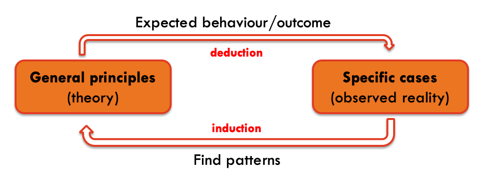
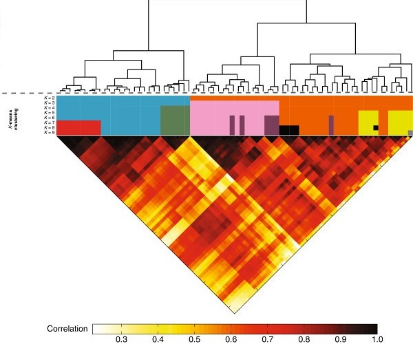

--- 
title: "Machine Learning for Biostatistics"
subtitle: "Module 1"
author: "Armando Teixeira-Pinto"
date: "`r Sys.Date()`"
site: bookdown::bookdown_site
output: bookdown::gitbook
documentclass: book
link-citations: yes
#bookdown::publish_book(account="tpinto_home", render=c("index.rmd", "all"))
#bookdown::render_book("index.rmd", "all")
---
```{r setup, include=FALSE}
knitr::opts_chunk$set(echo = TRUE)
```


# What is machine learning? {-} 


<iframe width="784" height="441" src="https://www.youtube.com/embed/HQO_VOWkWjQ" frameborder="0" allow="accelerometer; autoplay; encrypted-media; gyroscope; picture-in-picture" allowfullscreen></iframe>

We came a long way since the term *artificial intelligence* was first used by 
John McCarthy in the 50's. We still don't have computers capable of conversations
such as Hal 9000 from the movie 2001: A space odyssey, but we can easily 
identify some traces of *synthetic intelligence* in many of our interactions
with electronic devices. 

```{r hal, echo=FALSE, fig.align = 'center', out.width = "20%"}

```


When we ask something to *Siri* or *Alexa*, when we do a 
search in the web, when we get recommendations for
movies or shopping, when our car "reacts" to the proximity of other objects, 
when our spam email is filtered,
when we play chess against a computer or when we are automatically 
identified in photos posted in social media, these are some simple examples of
sophisticated systems that, one way or another, interpret the environment and 
take actions or make decision that maximize their chances of success.


Several examples can be also found in medical practice, such as patients' 
access to healthcare (e.g., [Babylon](https://search.proquest.com/openview/bf25c0b78beeffec5b3419ea7ffc79f9/1?pq-origsite=gscholar&cbl=2042228)), cancer diagnosis (e.g, [PathAI](https://jamanetwork.com/journals/jama/article-abstract/2665774)),
medical imaging (e.g., [Zebra Medical Vision](https://www.hbs.edu/faculty/Pages/item.aspx?num=55060)), diagnostic 
support systems
(e.g., [Buoy Health](https://www.bizjournals.com/boston/news/2018/08/22/boston-childrens-website-to-feature-self.html)) and drugs' development.


```{r robot, echo=FALSE, fig.align = 'center', out.width = "100%"}

```


In parallel with the development and dissemination of AI, we have also witness a 
a true data revolution in the past 30 years and a paradigm shift. Data used to 
be limited and "expensive" to acquire, whereas nowadays we produce more data than
we can process. Many of our daily actions are stored in different databases 
around the world. 

This is of particular relevance because AI systems, similar to the way our
brain works, rely on two principles to "learn": deduction and induction (I 
could also include abduction but trying to maintain things simple).  Initial
AI systems relied heavily in deductive methods. The system was given (taught) 
several rules and based on these rules and logic principles the
system could act. A complementary approach is to “learn” 
by recognising patterns in the data fed to the system. 

```{r induction, echo=FALSE, fig.align = 'center', out.width = "100%"}

```

The challenges brought by new problems and the availability of data in 
different format (image, video, text, …) required new approaches outside of 
the traditional statistical methods. Scientists with computer science and 
engineering background, as well as statisticians, tackled these problems and 
developed new methods and algorithms that take advantage of both large amounts 
of data, and computational power. Despite the clear overlap with statistics, 
the rapid development of this area, the major contribution from 
non-statisticians to these methods, and the specificity of some of the problems, 
fostered the creation of an independent scientific subject: **Machine Learning**. 
Coming from statistical background (and 
maybe with narrower focus) we could also call it **Statistical Learning**.  In 
fact, you may notice that the latter is used in the book we will follow.

```{r pattern, echo=FALSE, fig.align = 'center', out.width = "100%"}

``` 

An interesting perspective about [Machine Learning vs Statistics is presented 
by M. Stewart](https://towardsdatascience.com/the-actual-difference-between-statistics-and-machine-learning-64b49f07ea3).


## Datasets used in the examples {-}  
The file [bmd.csv](https://www.dropbox.com/s/7wjsfdaf0wt2kg2/bmd.csv?dl=1) 
contains 169 records of bone densitometries (measurement of 
bone mineral density). The following variables were collected:

* id – patient’s number  
* age – patient’s age
* fracture – hip fracture (fracture / no fracture)
* weight_kg – weight measured in Kg
* height_cm – height measure in cm   
* waiting_time – time the patient had to wait for the densitometry (in minutes)
* bmd – bone mineral density measure in the hip
